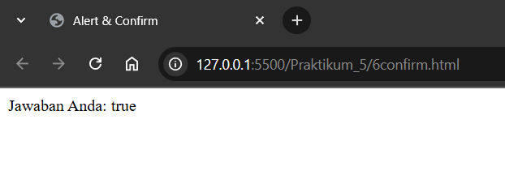
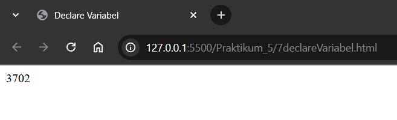

# Praktikum 5

Berikut analisis dari praktikum 5 berjudul `Dasar Java Script`

## 1. Javascript pada file HTML [`1tagScript.html`](1tagScript.html)
Output: 

Analisis:
- di tag script, ada attribute `language="javascript"` yaitu menandakan bahwa script nya memakai bahasa pemrograman javascript
- Di dalam tag head, ada tag script yang digunakan untuk menampilkan teks "Program JavaScript Aku di kepala" `document.write("Program JavaScript Aku di kepala")`
- Di dalam tag body, ada tag script yang digunakan untuk menampilkan teks "Program JavaScript Aku di body" `document.write("Program JavaScript Aku di body ")`

## 2. Event Tertentu [`2eventTertentu.html`](2eventTertentu.html)
Output:
- Gambar 1
  
  
- Gambar 2
  
  

Analisis :
- `<button onclick="tampilkan_nama()">klik disini</button>`
  - onclick adalah event yang akan dijalankan ketika tombol diklik
  - tampilkan_nama() adalah function yang akan dijalankan ketika tombol diklik
- `

`
  - id="hasil" adalah id dari div yang akan menampilkan nama
- `function tampilkan_nama(){
				document.getElementById("hasil").innerHTML = 
				"<h3>Nama Saya Adalah Shaquille Rashaun Sahl Tamrin</h3>"
			}`
	- ketika button onclick dijalankan (gambar1), maka function tampilkan_nama() akan dijalankan, `document.getElementById("hasil")` akan mengambil element div dengan id="hasil" setelah itu `.innerHTML` menambahkan `<h3>Nama Saya Adalah Shaquille Rashaun Sahl Tamrin</h3>` (gambar2)

## 3. Contoh Sederhana [`3contohSederhana.html`](3contohSederhana.html)
Output:

Analisis:
- `document.write("Selamat Belajar Angkatan 2024", " ")` document.write digunakan untuk menampilkan teks di dalam tag body. Disini menampilkan teks lalu break line
- `document.write("JavaScript Pemrograman WEB Teknik komputer")` Menampilkan teks "JavaScript Pemrograman WEB Teknik komputer"

## 4. Memasukkan Data [`4memasukkanData.html`](4memasukkanData.html)
Output:
- Gambar 1
  
  
- Gambar 2
  
  

Analisis:
- `var nama = prompt("Siapa nama Anda?")` prompt digunakan untuk memasukkan data dari user. Disini user diminta untuk memasukkan nama
- `document.write("Hai, " + nama )` document.write digunakan untuk menampilkan teks di dalam tag body. Disini menampilkan teks "Hai, " + nama (nama yang dimasukkan user)

## 5. Alert [`5alert.html`](5alert.html)
Output:

Analisis:
- `window.alert("Apakah anda akan meninggalkan laman ini?");` alert digunakan untuk menampilkan pesan di dalam pop up. Disini menampilkan pesan "Apakah anda akan meninggalkan laman ini?"

## 6. Confirm [`6confirm.html`](6confirm.html)
Output:
- Gambar 1
  
  
- Gambar 2
  
  
- Gambar 3
  
  

Analisis:
- `var jawaban = window.confirm("Apakah anda sudah yakin?");` confirm digunakan untuk menampilkan pop up dengan dua opsi yaitu "OK" dan "Cancel". Disini menampilkan pop up dengan pesan "Apakah anda sudah yakin?", Jika user memilih "OK" maka nilai true akan masuk ke dalam variabel jawaban, Jika user memilih "Cancel" maka nilai false akan masuk ke dalam variabel jawaban
- Jika user memilih "OK", maka jawaban akan menampilkan "Jawaban Anda: true" (gambar2)
- Jika user memilih "Cancel", maka jawaban akan menampilkan	"Jawaban Anda: false" (gambar3)

## 7. Mendeklarasi Variabel [`7declareVariabel.html`](7declareVariabel.html)
Output:

Analisis:
- Tipe `var` adalah tipe variabel yang paling dasar, dapat digunakan untuk mendeklarasikan variabel dengan nilai apapun. Tapi untuk sekarang lebih prefer memakai `let` dan `const`
- `var VariabelKu` mendeklarasikan variabel "VariabelKu"
- `var VariabelKu2 = 3` mendeklarasikan variabel "VariabelKu2" dan mengisinya dengan nilai 3
- `VariabelKu = 1234` mengisinya variabel "VariabelKu" dengan nilai 1234
- `document.write(VariabelKu * VariabelKu2)` menampilkan nilai dari perkalian "VariabelKu" dan "VariabelKu2"

## 8. Variabel Global [`8variabelGlobal.html`](8variabelGlobal.html)
Output:

Analisis:
- Variabel global adalah variabel yang dideklarasikan di luar function. Variabel global dapat diakses di dalam function maupun di luar function
- `var a = 12` mendeklarasikan variabel "a" dan mengisinya dengan nilai 12
- `var b = 4` mendeklarasikan variabel "b" dan mengisinya dengan nilai 4
- `function Perkalian_Dengan2(b){
    a = b * 2
	return a
}`
  - function Perkalian_Dengan2(b) mendeklarasikan function "Perkalian_Dengan2"
  - `a = b * 2` mengisinya variabel "a" dengan nilai "b" * 2
  - `return a` mengembalikan nilai dari variabel "a"
- Lalu menampilkan nilai dari `function Perkalian_Dengan2(b)` dan nilai variabel "a"

## 9. Variabel Local [`9variabelLokal.html`](9variabelLokal.html)
Output:

Analisis:
- Variabel lokal adalah variabel yang dideklarasikan di dalam function. Variabel lokal hanya dapat diakses di dalam function tersebut
- disini karena variabel "a" dideklarasikan di dalam function "Perkalian_Dengan2(b)", maka variabel "a" hanya dapat diakses di dalam function "Perkalian_Dengan2(b)"
- Maka ketika variabel "a" diakses di luar function "Perkalian_Dengan2(b)", maka variabel "a" tetap bernilai 12, bukan lagi bernilai `b * 2`

## 10. Konversi Tipe Data [`10konversiTipeData.html`](10konversiTipeData.html)
Output:

Analisis:
- `var a = parseInt("27")` mengkonversi string "27" menjadi integer 27
- `var a = parseInt("27.5")` mengkonversi string "27.5" menjadi integer 27
- `var a = parseInt("27A")` mengkonversi string "27A" menjadi integer 27
- `var a = parseInt("A27.5")` mengkonversi string "A27.5" menjadi integer NaN (Not a Number) karena string "A27.5" memiliki karakter non-numerik di awal
- `var b = parseFloat("27")` mengkonversi string "27" menjadi float 27
- `var b = parseFloat("27.5")` mengkonversi string "27.5" menjadi float 27.5
- `var b = parseFloat("27A")` mengkonversi string "27A" menjadi float 27
- `var b = parseFloat("A27.5")` mengkonversi string "A27.5" menjadi float NaN (Not a Number) karena string "A27.5" memiliki karakter non-numerik di awal

## 11. Operator Aritmatika [`11operatorAritmatika.html`](11operatorAritmatika.html)
Output:

Analisis:
- `document.write("2 + 3 = "+(a+b))` menampilkan nilai penjumlahan `2 + 3 = 5`
- `document.write(" ")` menampilkan baris baru
- `document.write("20 - 3 = "+(a-b))` menampilkan nilai pengurangan `20 - 3 = 17`
- `document.write(" ")` menampilkan baris baru
- `document.write("2 * 3 = "+(a*b))` menampilkan nilai perkalian `2 * 3 = 6`
- `document.write(" ")` menampilkan baris baru
- `document.write("40 / 3 = "+(a/b))` menampilkan nilai pembagian `40 / 3 = 13.333333333333334`

## 12. Operator Logika dan Pembanding [`12operatorLogikadanPembanding.html`](12operatorLogikadanPembanding.html)
Output:

- Gambar 1
  
  
- Gambar 2
  
  
- Gambar 3
  
  

Analisis:
- `var nilai = prompt("Nilai (0-100)")` meminta user memasukkan nilai (0-100) dan menyimpannya di variabel "nilai" (gambar1)
- `var hasil = (nilai >= 60) ? "Lulus" : "Tidak Lulus"`
  - Jika "nilai" lebih besar atau sama dengan 60, maka "hasil" akan bernilai "Lulus" (gambar2)
  - Jika "nilai" kurang dari 60, maka "hasil" akan bernilai "Tidak Lulus" (gambar3)

## Tugas 1 [`tugas1.html`](tugas1.html)
Output:
- Gambar Input

- Gambar Output

## Tugas 2 [`tugas2.html`](tugas2.html)
Output:
- Gambar Input 1

- Gambar Input 2

- Gambar Output

## Tugas 3 [`tugas3.html`](tugas3.html)
Output:
- Gambar Input

- Gambar Output

## Tugas 4 [`tugas4.html`](tugas4.html)
Output:
- Gambar Input

- Gambar Output Volume Balok

- Gambar Output Volume Kubus

- Gambar Output Volume Bola

